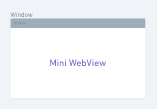
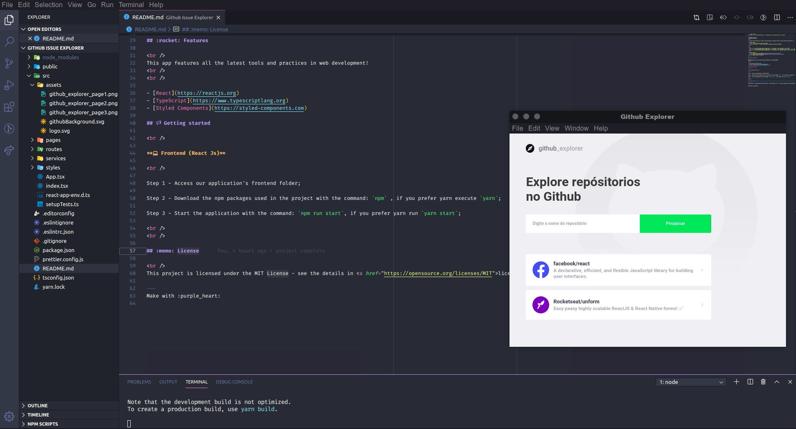

<h1 align="center">
     
</h1>

<h3 align="center">
  Mini Webview for WebDevs
</h3>

Small webview that can be used for web development when you don't have a second monitor.

  <a href="#rocket-tecnologies">Tecnologies</a>&nbsp;&nbsp;&nbsp;|&nbsp;&nbsp;&nbsp;
  <a href="#-how-to-use">how to use</a>&nbsp;&nbsp;&nbsp;|&nbsp;&nbsp;&nbsp;
  <a href="#memo-license">License</a>

  

     

 
 

## :rocket: Tecnologies
[//]: # (Add the features of your project here:)

 
This app features all the latest tools and practices in mobile development!
 
 

- [Javascript.js](https://nodejs.org/en/)
- [Electron](https://https://www.electronjs.org/)
- [Visual Studio Code](https://code.visualstudio.com/)

## 📢 how to use

 

Step 1 - Access our application's node server folder;

Step 2 - Download the npm packages used in the project with the command: `npm` , if you prefer yarn execute `yarn`;

Step 3 - Start the application with the command: `npm run start`, if you prefer yarn run `yarn start`;

- the mini webview is on top of other system windows, such as the own visual studio code, which allows you to see how the web project is doing while still editing via live-server, as the webview shows the url localhost: 3000.

 
 

## :memo: License

 
This project is licensed under the MIT License - see the details in <a href="https://opensource.org/licenses/MIT">page</a>.

---
Make with :purple_heart:
